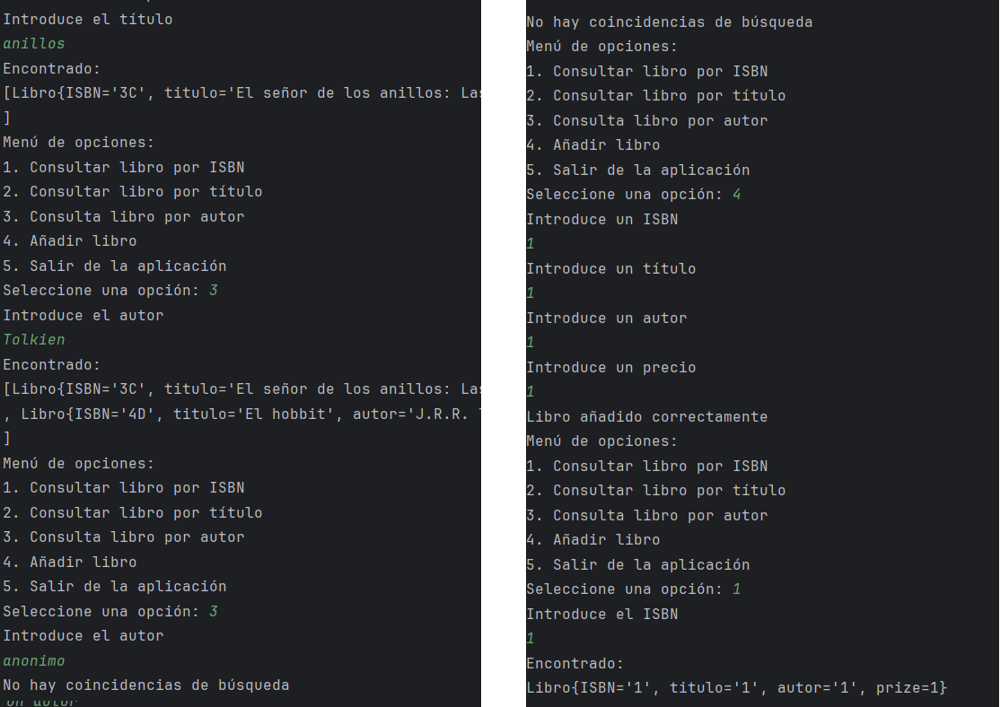

# Actividad 1. Hilos y Sockets

## Arquitectura del programa

Como paso previo comenzamos diseñando la arquitectura del programa a desarrollar. De acuerdo a los requirementos del ejercicio, y simplemente leyendo el enunciado, sabemos que necesitaremos los siguientes componentes:

1. Un cliente, donde se ejecutarán las operaciones de interacción con el servidor. El cliente va a necesitar:
   - Un socket para la comunicación con el servidor.
   - Un modelo "Libro" -para representar nuestro objeto "Libro".
   - Un servicio "LibroService" que encapsulará la lógica de todas las operaciones relacionadas con el Libro.
   - Una clase main para ejecutar el programa.
  
2. Un servidor, donde se ejecutarán las operaciones propias del servidor y la conexión a la base de datos. El servidor necesitará:
   - Un socket para la comunicación con el cliente.
   - Un modelo "Libro" -para representar nuestro objeto "Libro".
   - Un modelo DAO, que encapsulará la lógica de todas las operaciones relacionadas con el Libro.

En circunstancias normales existiría un modelo libro para el servidor y otro distinto para el cliente -ya que servidor y cliente van a correr en distintas máquinas-. Pero como se trata de un ejercicio de clase, y para evitar duplicar el código, crearemos un paquete "model" donde la clase libro será compartida.

Los dos programas quedarían estructurados así:

````
MODEL
    |_Libro


CLIENTE
    |_ Clase main
    |_ Socket para el cliente
    |_ service
        |_ LibroService

SERVIDOR
    |_ Clase main
    |_ DAO
    |   |_ LibroDao
    |_ Models
        |_ Libro
````

Opcionalmente, sería posible crear un "buffer libros", pero dado que el concepto del progrmaa es una "Biblioteca", se da por hecho que habrá cierta persistencia en la recopilación y almacenamiento de datos, por lo que es más apropiado trabajar con un DAO.

# Desarrollo del cliente

Comenzamos estableciendo la conexión con el servidor. Para ello, necesitamos la dirección IP y el puerto al que nos vamos a conectar. En este caso, la dirección IP será "localhost" y el puerto 2000. 

````java
 String ipv4 = "localhost";
        int port = 2000;
        System.out.println("APLICACIÓN CLIENTE");
        System.out.println("-----------------------------------");
        Scanner scanner = new Scanner(System.in);

        try {
            /**Un InetSocketAddress es solo una combinación de una dirección IP (o nombre de host) y un número de puerto.
             * No es una conexión en sí misma, sino una dirección que indica a qué IP y puerto se quiere conectar o enlazar. */
            ClienteSocket clienteSocket = new ClienteSocket(ipv4, port);
            LibroService libroService = new LibroService(clienteSocket);

````

Ciertamente, nuestra clase cliente no va a hacer nada más. Ya que el resto de la lógica quedará encapsulada dentro de nuestras clases "ClienteSocekt" y "LibroService".

## Clase ClienteSocket

ClienteSocket se encargará de establecer la conexión con el servidor. Para asegurar su correcto funcionamiento, crearemos 3 métodos: uno para enviar peticiones, otro para recibir respuestas y un tercer método para cerrar la conexión.

````java

package CLIENTE;

import java.io.*;
import java.net.Socket;

public class ClienteSocket {
    private Socket socket;
    private BufferedReader reader;
    private PrintWriter writer;

    public ClienteSocket(String ipv4, int port) throws IOException {
        this.socket = new Socket(ipv4, port);
        this.reader = new BufferedReader(new InputStreamReader(socket.getInputStream()));
        this.writer = new PrintWriter(new OutputStreamWriter(socket.getOutputStream()), true);
    }

    public void sendMessage(String message) throws IOException {
        writer.write(message + "\n");
        writer.flush();
    }

    public String receiveMessage() throws IOException {
        return reader.readLine();
    }

    public void close() throws IOException {
        reader.close();
        writer.close();
        socket.close();
    }
    
}

````

## Clase LibroService

A diferencia del modelo DAO, que se encarga de operaciones relacionadas con la base de datos, un servicio simplemente nos facilita la persistencia de datos y la manera de manejar el formato en el que se va a enviar y recibir la información. Nuestra clase LibroService tendrá los siguientes métodos:

- Un método para buscar un solo libro (toma como parámetros un criterio y un valor de búsqueda).
- Un método para buscar varios libros (toma como parámetros un criterio y un valor de búsqueda).
- Un método para procesar la respuesta de búsqueda de un solo libro.
- Un método para procesar la respueta de varios libros.
- Un método para añadir un libro.
- Un método para enviar peticiones de búsqueda.

Mantener estos métodos con este formato permitirá reutilizar o ampliar el código fácilmente en el futuro si, por ejemplo, se decidiesen crear nuevos parámetros de búsqueda.


### Envío de peticiones

Para optimizar el envío de peticiones, se ha optado por enviar la información en formato JSON con un "header" y un "body". Para simplificar el ejercicio al máximo, el header simplemente contendrá la información clave sobre qué debe hacer el servidor con el contenido del "body".

A la hora de enviar la información, esta se convertirá en un String de texto plano.


````java

    public String sendRequest(String criterio, String value) throws IOException {
        JsonObject jsonRequest = new JsonObject();
        jsonRequest.addProperty("header", "getBy" + criterio);
        jsonRequest.addProperty("body", value);
        clienteSocket.sendMessage(jsonRequest.toString());
        return clienteSocket.receiveMessage();
    }
                        
````

### Recepción de respuesta

Inmediatamente, si la conexión es exitosa, el socket debería recibir la respuesta del servidor (que igualmente vendrá en un JSON con un header y body). Para la lectura y el procesamiento de este JSON harán falta distintos métodos, dependiendo del tipo de información que se espera recibir (si es un libro, varios o un booleano). Un ejemplo de recepción quedaría así:


````java
    private Libro procesarRespuestaUnLibro(String respuesta) {
        JsonObject jsonResponse = JsonParser.parseString(respuesta).getAsJsonObject();
        JsonObject bodyResponse = jsonResponse.getAsJsonObject("body");
        JsonObject selectedBook = bodyResponse.getAsJsonObject("content");

        if (selectedBook.size() == 0) {
            return null;
        } else {
            return gson.fromJson(selectedBook, Libro.class);
        }
    }
````

### Método de unión

Como punto de unión entre el envío y la recepción de la respuesta, hay distintos métodos que se encargan de "clasificar" cómo se va a producir. Estos métodos, a su vez, tendrán nombres estandarizados para que sean fácilmente reconocibles desde el cliente:


````java
    public Libro findOne(String criterio, String value) throws IOException {
        String respuesta = sendRequest(criterio, value);
        return procesarRespuestaUnLibro(respuesta);
    }

    public ArrayList<Libro> findMany(String criterio, String value) throws IOException {
        String respuesta = sendRequest(criterio, value);
        return procesarRespuestaVariosLibros(respuesta);
    }
````

### Clase main del cliente

La clase main del cliente únicamente se encargará de simular una interfaz gráfica para redirigir las consultas y, como mucho, guardar en variables las respuestas del servidor para que puedan ser utilizadas posteriormente  para cualquier propósito. Para ello, solo hemos usado un menú, mensajes por consola y un switch-case.


# Desarrollo del Servidor

A la hora de recibir la respuesta en el cliente, también se ha optado por utilizar un formato JSON, que en este caso bien podrá recibirse dentro del "body" un JSON Object -para cuando se reciba un solo libro-, un JSON Array -para cuando en la consulta se requieran varios libros.

Para recibir la respuesta, bastará con parsear el JSON y obtener el contenido del "body" de la respuesta:

````java
    InputStream entrada = cliente.getInputStream();
    BufferedReader reader = new BufferedReader(new InputStreamReader(entrada));
    //Resto del código para recibir la respuesta
    //...

    String mensaje = reader.readLine();
    JsonObject jsonResponse = JsonParser.parseString(mensaje).getAsJsonObject();
    JsonObject headerResponse = jsonResponse.getAsJsonObject("header");
    JsonObject bodyResponse = jsonResponse.getAsJsonObject("body");

    
````

Posteriormente, debemos saber hacer una correcta lectura tanto del header como del body. Nosotros sabemos que el header únicamente contiene un String (aunque en un caso real podría contener todo tipo de información). Sin embargo, el body puede ser tanto un Array como un Object o un Boolean, lo que nos obliga a tratar el body como un JSON Element y no especificar de qué tipo se trata.

````java
    String messageHeader = headerResponse.get("header").getAsString();
    JsonElement contentResponse = bodyResponse.get("content");

````

El siguiente paso será tratar el contenido del body. En este caso, se ha optado por un switch-case para tratar los diferentes tipos de respuesta que se pueden recibir:

````java
    switch (messageHeader) {
        case "getByISBN":
            JsonObject selectedBook = contentResponse.getAsJsonObject();
            break;
        case "getByTitle": case "getByAuthor":
            JsonArray selectedBooks = contentResponse.getAsJsonArray();
            break;
        case "postBook":
            boolean value = contentResponse.getAsBoolean();
            break;
    }
````

Hecho este paso, ya disponemos dentro del cliente tanto el objeto Libro como el Array, lo cuál nos permitirá acceder libremente tanto a las propiedades de cada objeto recuperado, como iterar sobre cada objeto del array. Como paso final, verificamos que el array no está vacío (! array.isEmpty) o que su tamaño es mayor que 0 (object.size() != 0). Si se cumple alguna de estas condiciones, debemos informar al cliente que no se ha recuperado ningún objeto del servidor. 

Para el caso de postBook, se ha optado por notificar con un boolean si la operación ha sido exitosa o no.


## Desarrollo del servidor

La arquitectura del servidor es sutilmente más compleja. Una vez se ha establecido exitosamente la conexión, debemos recibir la información que llega del cliente. Esta información llega como texto plano por lo que será necesario parsearla.


### Estableciendo la conexión

```java
lic class Servidor {

    public static void main(String[] args) {
        LibroDAO biblioteca = new LibroDAO();
        
        String ipv4 = "localhost";
        System.out.println("APLICACIÓN DE SERVIDOR");
        System.out.println("----------------------------------");

        try {
            ServerSocket servidor = new ServerSocket();
            InetSocketAddress direccion = new InetSocketAddress(ipv4, 2000);
            servidor.bind(direccion);
            System.out.println("Servidor creado y escuchando .... ");
            System.out.println("Dirección IP: " + direccion.getAddress());

            while (true) {
                Socket enchufeAlCliente = servidor.accept();
                System.out.println("Comunicación entrante");

                // Creamos un nuevo hilo para manejar al cliente
                new Thread(() -> {
                    // Resto del código

```

Una vez está la conexión está establecida, debemos crear un hilo para cada cliente (new Thread()). El hilo espera como parámetro una función lambda que se ejecutará cada vez que un cliente se conecte al servidor. Dentro del hilo, definimos los pasos a seguir para recibir la petición del cliente y enviar la respuesta (el InputStream y el OutputStream, con sus respectivos reader y writer).

```java
     //ENTRADA
    InputStream entrada = enchufeAlCliente.getInputStream();
    BufferedReader reader = new BufferedReader(new InputStreamReader(entrada));
    String mensaje = reader.readLine();

    //SALIDA
    OutputStream salida = enchufeAlCliente.getOutputStream();
    PrintWriter writer = new PrintWriter(new OutputStreamWriter(salida), true);
    

```

### Recepción de la petición

Los canales ya están abierto y se pueden recibir mensajes. Ahora toca "descifrar" las peticiones entrantes. Nosotros hemos decidido trabajar con objetos de tipo JSON. Eso nos obliga a parsear el texto plano que llega del cliente y convertirlo en un objeto JSON. 


```java
    while (mensaje != null) {
        // Objeto para ENVIAR respuesta al CLIENTE
        JsonObject jsonResponse = new JsonObject();
        JsonObject header = new JsonObject();
        JsonObject body = new JsonObject();
        jsonResponse.add("header", header);
        jsonResponse.add("body", body);

        // Objeto para RECIBIR petición
        JsonObject jsonRequest = JsonParser.parseString(mensaje).getAsJsonObject();
        String requestHeader = jsonRequest.get("header").getAsString();
        String requestBody;
```
Puesto que ya tenemos el tipo de método que se quiere aplicar y un cuerpo, será suficiente con aplicar un switch-case y guardar el resultado dentro de nuestro jsonResponse (la respuesta del servidor). A su vez, la respuesta irá con header, que permitirá al cliente saber qué tiene que hacer con cada respuesta, y un body, con el contenido propiamente.

### Posibles respuestas

Como veaíamos en el cliente, existen diferentes posibles respuestas, que pueden ir en los siguientes formatos:

1. Un JsonObject (si solo se devuelve un libro).
2. Un JsonArray (si se devuelven varios libros).
3. Un boolean (si se ha añadido un libro, que puede resultar en true o false).
4. Un objeto o un array vacío (si no hay coincidencias en la base de datos).
5. Un mensaje de salida para cuando se cierra la conexión.


Sea cual sea el objeto de respuesta del servidor, lo convertiremos a texto plano y lo enviaremos:

````java
    salida.write((jsonResponse.toString() + "\n").getBytes() );
````

### Modelos DAO (synchronus) y Libro

En este punto no nos entretendremos demasiado. Es suficinete con saber que tanto el DAO como el Libro encapsulan la lógica de los objetos creados y las operaciones CRUD (aunque en este ejercicio solo se presentan operaciones de consulta y añadido).

Como detalle importante, la operación "añadir" debe quedar bloqueada en caso de que uno de los hilos acceda a ella, y solamente desbloqueará el programa cuando concluya. Para simular este "bloqueo" -y comprobar que efectivamente el programa ha quedado bloqueado- se ha decido implementar un Threat.sleep(3000) para simular que el bloqueo funciona correctamente, es decir, nunca van a llegar varias peticiones de añadir libro simultáneamente.

````java

    public synchronized boolean add(JsonObject bookObject) {
        String isbn = bookObject.get("ISBN").getAsString();
        String title = bookObject.get("title").getAsString();
        String author = bookObject.get("author").getAsString();
        String prize = bookObject.get("prize").getAsString();
        System.out.println("AÑADIENDO LIBRO: " + bookObject.toString());

        Libro nuevoLibro = new Libro(isbn, title, author, prize);
        try {
            /*Simulamos un retraso de 4 segundos.
            * Si el hilo está bien sincronizado, nunca podrán salir por consola
            * simultaneamente varios mensajes, ya que el hilo está bloqueando el proceso.*/
            Thread.sleep(4000);

            if (findByIsbn(nuevoLibro.getISBN()).size() != 0){
                System.out.println("El libro ya existe");
                return false;

            } else {
                listaLibros.add(nuevoLibro);
            }
            return true;

        } catch (InterruptedException e) {
            Thread.currentThread().interrupt(); // Restaura el estado de interrupción
        } catch (Exception e){
            System.out.println("Datos incompletos, introduce un formato de libro válido");
            return false;
        }
        return true;
    }
````

Dentro del DAO, el único método que tiene cierta complejidad es el de añadir libro, que, como comentábamos antes, recibe un objeto completo y necesitará acceder a cada propiedad de dicho objeto para crear un nuevo libro.

### Observaciones

- Legibilidad del código: la clase "Cliente" es demasiado extensa y debería dividirse en varios clases (una para gestionar los sockets, otra para procesar la respuesta), de tal forma que cada una tenga una responsabilidad única (SOLID).

- Dentro del código hay varios mensajes por consola para depurar y comprobar que el programa funciona correctamente. En un caso real, estos mensajes deberían ser eliminados o comentados.

- La propiedad "prize" del libro se ha declarado como String, aunque en un caso real debería ser un tipo numérico (double o float). Al no haber operaciones aritméticas, y para evitar tener que realizar un casting, se ha simplificado como String.

- En un caso real, y dentro del cliente, verificaríamos que el JSON que está llegando se corresponde exactamente con el tipo que queremos manejar. Es decir, nosotros damos por hecho que al recibir un JSON Object de verdad se trata de un Json Object, y por ello manipulamos el objeto directamente, aunque esto es algo que debemos verificar antes de ejecutar. 


## Resultados

A continuación se presentan los patanllazos de la ejecución del programa:



