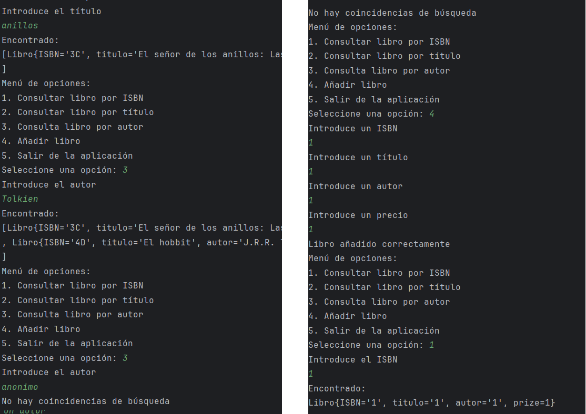
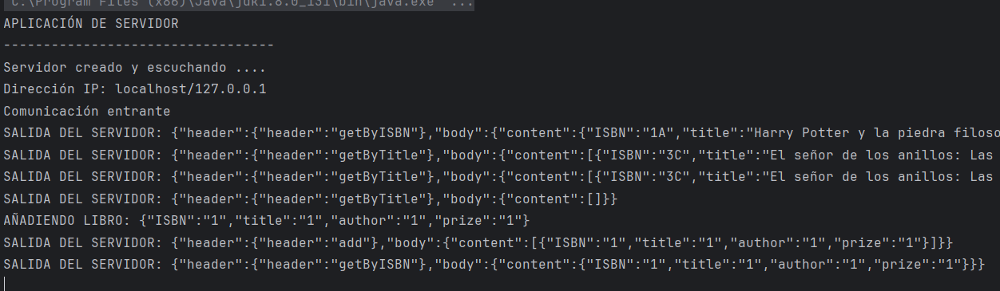

# Actividad 1. Hilos y Sockets

## Arquitectura del programa

Como paso previo comenzamos diseñando la arquitectura del programa a desarrollar. De acuerdo a los requirementos del ejercicio, y simplemente leyendo el enunciado, sabemos que necesitaremos los siguientes componentes:

1. Un cliente, donde se ejecutarán las operaciones de interacción con el servidor. El cliente va a necesitar:
   - Un socket para la comunicación con el servidor.
   - Un modelo "Libro" -para representar nuestro objeto "Libro".
   - Un servicio "LibroService" que encapsulará la lógica de todas las operaciones relacionadas con el Libro.
   - Una clase main para ejecutar el programa.
  
2. Un servidor, donde se ejecutarán las operaciones propias del servidor y la conexión a la base de datos. El servidor necesitará:
   - Un socket para establecer la conexión y aceptar peticiones (y no hará nada más).
   - Un modelo "Libro" -para representar nuestro objeto "Libro".
   - Un modelo DAO, que encapsulará la lógica de todas las operaciones relacionadas con el Libro.
   - Una clase para poder manejar cada petición entrante de forma individual.

En circunstancias normales existiría un modelo libro para el servidor y otro distinto para el cliente -ya que servidor y cliente van a correr en distintas máquinas-. Pero como se trata de un ejercicio de clase, y para evitar duplicar el código, crearemos un paquete "model" donde la clase libro será compartida.

Los dos programas quedarían estructurados así:

````
MODEL
    |_Libro


CLIENTE
    |_ Clase main
    |_ Socket para el cliente
    |_ service
        |_ LibroService

SERVIDOR
    |_ Clase main
    |_ Clients
    |  |_ HandleClient
    |_ DAO
    |   |_ LibroDao
    |_ Models
        |_ Libro
````

Opcionalmente, sería posible crear un "buffer libros", pero dado que el concepto del progrmaa es una "Biblioteca", se da por hecho que habrá cierta persistencia en la recopilación y almacenamiento de datos, por lo que es más apropiado trabajar con un DAO.

# Desarrollo del cliente

Comenzamos estableciendo la conexión con el servidor. Para ello, necesitamos la dirección IP y el puerto al que nos vamos a conectar. En este caso, la dirección IP será "localhost" y el puerto 2000. 

````java
 String ipv4 = "localhost";
        int port = 2000;
        System.out.println("APLICACIÓN CLIENTE");
        System.out.println("-----------------------------------");
        Scanner scanner = new Scanner(System.in);

        try {
            ClienteSocket clienteSocket = new ClienteSocket(ipv4, port);
            LibroService libroService = new LibroService(clienteSocket);

````

Ciertamente, nuestro método Main del cliente lo único que hará después de establecer la conexión es **"pintar" el menú** y **simular una interfaz gráfica para introducir y pintar datos por consola**. No hará nada más, ya que el resto de la lógica quedará encapsulada dentro de nuestras clases "ClienteSocekt" y "LibroService".

## Clase ClienteSocket

ClienteSocket se encargará de establecer la conexión con el servidor. Para asegurar su correcto funcionamiento, crearemos 3 métodos: uno para enviar peticiones, otro para recibir respuestas y un tercer método para cerrar la conexión.

````java

package CLIENTE;

import java.io.*;
import java.net.Socket;

public class ClienteSocket {
    private Socket socket;
    private BufferedReader reader;
    private PrintWriter writer;

    public ClienteSocket(String ipv4, int port) throws IOException {
        this.socket = new Socket(ipv4, port);
        this.reader = new BufferedReader(new InputStreamReader(socket.getInputStream()));
        this.writer = new PrintWriter(new OutputStreamWriter(socket.getOutputStream()), true);
    }

    public void sendMessage(String message) throws IOException {
        writer.write(message + "\n");
        writer.flush();
    }

    public String receiveMessage() throws IOException {
        return reader.readLine();
    }

    public void close() throws IOException {
        reader.close();
        writer.close();
        socket.close();
    }
    
}

````

## Clase LibroService

A diferencia del modelo DAO, que se encarga de operaciones relacionadas con la base de datos, un servicio simplemente nos facilita la persistencia de datos y la manera de manejar el formato en el que se va a enviar y recibir la información. Nuestra clase LibroService tendrá los siguientes métodos:

- Un método de búsqueda.
- Un método para añadir.
- En caso de escalar el programa, necesitaríamos un método para actualizar y otro para borrar.

Además, harán falta métodos para procesar la petición y la respuesta:
- Un método para procesar el envío (y que el formato sea adecuado).
- Un método para recibir la respuesta (parseándolas con el formato adecuado).
  
**NOTA**
Adicionalmente hemos creado una propiedad estática dentro de nuestro LibroService para que podamos acceder al resultado de la búsqueda desde cualquier parte del programa.

````java	
private static ArrayList<Libro> resultadoBusqueda;
````

Esto hará que independientemente desde donde nos conectemos dentro de la aplicación, cada vez que usemos el método getResultadoBusqueda() podamos acceder a la última búsqueda realizada y no sea necesario crear una nueva instancia con una nueva petición.


### Envío de peticiones

Para optimizar el envío de peticiones, se ha optado por enviar la información en formato JSON con un "header" y un "body". Para simplificar el ejercicio al máximo, el header simplemente contendrá la información clave sobre qué debe hacer el servidor con el contenido del "body".

A la hora de enviar la información, esta se convertirá en un String de texto plano.


````java

    public String sendRequest(String criterio, String value) throws IOException {
        JsonObject jsonRequest = new JsonObject();
        jsonRequest.addProperty("header", "getBy" + criterio);
        jsonRequest.addProperty("body", value);
        clienteSocket.sendMessage(jsonRequest.toString());
        return clienteSocket.receiveMessage();
    }
                        
````

### Recepción de respuesta

Inmediatamente, si la conexión es exitosa, el socket debería recibir la respuesta del servidor (que igualmente vendrá en un JSON con un header y body). Parseamos el contenido y guardamos el resultado de la búsqueda dentro de nuestra propiedad estática.

````java
    private void procesarRespuesta(String respuesta) {
        ArrayList<Libro> libros = new ArrayList<>();
        JsonObject jsonResponse = JsonParser.parseString(respuesta).getAsJsonObject();
        JsonArray selectedBooks = jsonResponse.getAsJsonObject("body").getAsJsonArray("content");
        for (JsonElement book : selectedBooks) {
            libros.add(gson.fromJson(book, Libro.class));
        }
        resultadoBusqueda = libros;
    }

````

### Resultados en ArrayList

Aunque no es una solución óptima, se ha decidido guardar todos los resultados dentro de un ArrayList y, a partir de ahí, manejar la información. En un caso real, no lo guardaríamos dentro de un ArrayList. Posiblemente querríamos guardar las peticiones que recuperan un solo objeto dentro de una clase o directamente en el JSON.  Para las operaciones de Create, Update y Delete, posiblemente devolveríamos un booleano. Aunque de momento lo dejaremos así.


# Desarrollo del Servidor

Pero por el momento, esto es lo que encontraremos dentro del servidor:

1. Un método main con un socket para establecer la conexión con un bucle while que establecerá una conexión con cada cliente que se conecte.
2. Una Clase para gestionar cada petición entrante (a la que hemos llamado HandleClient).
3. Un modelo DAO para facilitar el acceso a datos y la manipulación de los mismos.

Al final, el método main del servidor quedaría así:

````java
public class Servidor {
    public static void main(String[] args) {

        String ipv4 = "localhost";
        System.out.println("APLICACIÓN DE SERVIDOR");
        System.out.println("----------------------------------");

        try {
            ServerSocket servidor = new ServerSocket();
            InetSocketAddress direccion = new InetSocketAddress(ipv4, 2000);
            servidor.bind(direccion);
            System.out.println("Servidor creado y escuchando .... ");
            System.out.println("Dirección IP: " + direccion.getAddress());

            while (true) {
                Socket enchufeAlCliente = servidor.accept();
                System.out.println("Comunicación entrante");

                // Creamos un nuevo hilo para manejar a cada cliente entrante
                new ClientHandler(enchufeAlCliente);
            }
        } catch (IOException e) {
            System.out.println("Error al leer o escribir datos, posiblemente por una desconexión del cliente: " + e.getMessage());

        } catch (RuntimeException e){
            System.out.println("El cliente se ha desconectado del servidor");
        }
    }

}
````

## Clase HandleClient

Cada nueva petición entrante creará un nuevo hilo a partir de la clase HandleClient. Y dentro de esta clase, es donde se gestionarán todas las peticiones entrantes y las respuestas del servidor a ese cliente en concreto.

````java
public class ClientHandler implements Runnable {
    private Thread hilo;
    // Resto de propiedades

    public ClientHandler(Socket clientConnection) {
        // resto de propieaddes en el constructor
        this.hilo = new Thread(this, "Usuario-" + contador++);
        this.hilo.start();
    }


    @Override
    public void run() {
        try {
            obtenerFlujoDatos();
            while ((mensaje = reader.readLine()) != null) {
                JsonElement result = handleRequest();
                if (!clientConnection.isClosed()) {
                    sendResponse("Código 200: Ok", result);
                } else {
                    System.out.println("El socket está cerrado. Terminando la conexión.");
                    break;
                }
            }
        } catch (IOException e) {
            System.out.println("Error al recibir o enviar datos: " + e.getMessage());
        } catch (NullPointerException e) {
            System.out.println("El mensaje recibido es nulo: " + e.getMessage());
        } catch (RuntimeException e) {
            System.out.println("Error en la ejecución del servidor: " + e.getMessage());
        } finally {
            try {
                if (clientConnection != null && !clientConnection.isClosed()) {
                    clientConnection.close();
                    System.out.println("Conexión cerrada correctamente.");
                }
            } catch (IOException e) {
                System.err.println("Error al cerrar el socket: " + e.getMessage());
            }
        }
    }

````

### Procesamiento de peticiones

Para gestionar las peticiones, contaremos con los siguietnes métodos:
1. Un método para abrir el flujo de datos.
2. Un método para procesar la petición.
3. Un método para enviar la respuesta.
4. Un método para cerrar la conexión.


Para el envío de la petición, se ha creado un método que tomará como parámetros el outputStream, el header y el contenido del body. No es imprescindible como tal, pero el método retornará la respuesta (por si fuese necesario utilizarla en un futuro para algo).

Al estructurar el código de esta manera, en caso de que queramos cambiar la forma de procesar las peticiones entrantes, o queramos cambiar la manera de enviar respuestas, simplemente tendremos que ir al método afectado y adaptarlo a las nuevas necesidades del programa.


````java
private synchronized JsonObject sendResponse(String headerContent, JsonElement bodyContent) throws IOException {
        try {
            JsonObject jsonResponse = new JsonObject();
            JsonObject responseHeader = new JsonObject();
            JsonObject responseBody = new JsonObject();
            jsonResponse.add("header", responseHeader);
            jsonResponse.add("body", responseBody);

            responseHeader.addProperty("header", headerContent);
            responseBody.add("content", bodyContent);

            System.out.println("SALIDA DEL SERVIDOR: " + jsonResponse);
            salida.write((jsonResponse.toString() + "\n").getBytes());

            return jsonResponse;

        } catch (IOException e) {
            throw(e);
        }
    }
````

Por ejemplo, aquí estamos manejando el envío de respuestas. Si el día de mañana fuera necesario añadir un certificado de seguridad al Header, o un Status, o cualquier otro tipo de información, simplemente tendríamos que añadirlo en el método sendResponse. Esta misma lógica se ha aplicado a la recepción de peticiones.


### Modelos DAO (synchronus) y Libro

En este punto no nos entretendremos demasiado. Es suficinete con saber que tanto el DAO como el Libro encapsulan la lógica de los objetos creados y las operaciones CRUD (aunque en este ejercicio solo se presentan operaciones de consulta y añadido).

Como detalle importante, la operación "añadir" debe quedar bloqueada en caso de que uno de los hilos acceda a ella, y solamente desbloqueará el programa cuando concluya. Para simular este "bloqueo" -y comprobar que efectivamente el programa ha quedado bloqueado- se ha decido implementar un Threat.sleep(3000) para simular que el bloqueo funciona correctamente, es decir, nunca van a llegar varias peticiones de añadir libro simultáneamente.

````java

    public synchronized JsonArray add(JsonObject bookObject) {
        JsonArray jsonBookList = new JsonArray();

        String isbn = bookObject.get("ISBN").getAsString();
        String title = bookObject.get("title").getAsString();
        String author = bookObject.get("author").getAsString();
        String prize = bookObject.get("prize").getAsString();
        System.out.println("AÑADIENDO LIBRO: " + bookObject.toString());

        Libro nuevoLibro = new Libro(isbn, title, author, prize);
        try {
            /*Simulamos un retraso de 4 segundos.
            * Si el hilo está bien sincronizado, nunca podrán salir por consola
            * simultaneamente varios mensajes, ya que el hilo está bloqueando el proceso.*/
            Thread.sleep(4000);

            if (findByIsbn(nuevoLibro.getISBN()).size() != 0){
                System.out.println("El libro ya existe");
            } else {
                listaLibros.add(nuevoLibro);
                JsonObject libroJson = gson.toJsonTree(nuevoLibro).getAsJsonObject();
                jsonBookList.add(libroJson);
            }

        } catch (InterruptedException e) {
            Thread.currentThread().interrupt(); // Restaura el estado de interrupción
        } catch (Exception e){
            System.out.println("Datos incompletos, introduce un formato de libro válido");
        }
        return jsonBookList;
    }
````

Cabe destacar que el método añadir devolverá un JsonArray que podría estar vacío -si el libro ya existe-, o contener el libro añadido. En realidad esto no es importante. Lo único que nos interesa es tener un parámetro con el que saber si se ha añadido el libro con éxito o no. Así, dentro del cliente, solo tendremos que verificar el tamaño del JsonArray. Otra forma más elegante de manejarlo habría sido con un booleano. Aunque en este caso se ha optado por el JsonArray para reutilizar los métodos que ya teníamos creados en el cliente.


### Observaciones

- Dentro del código hay varios mensajes por consola para depurar y comprobar que el programa funciona correctamente. En un caso real, estos mensajes deberían ser eliminados o comentados.

- La propiedad "prize" del libro se ha declarado como String, aunque en un caso real debería ser un tipo numérico (double o float). Al no haber operaciones aritméticas, y para evitar tener que realizar un casting, se ha simplificado como String.

- En un caso real, y dentro del cliente, verificaríamos que el JSON que está llegando se corresponde exactamente con el tipo que queremos manejar. Es decir, nosotros damos por hecho que al recibir un JSON Object de verdad se trata de un Json Object, y por ello manipulamos el objeto directamente, aunque esto es algo que debemos verificar antes de ejecutar. 


## Resultados

A continuación se presentan los patanllazos de la ejecución del programa:



