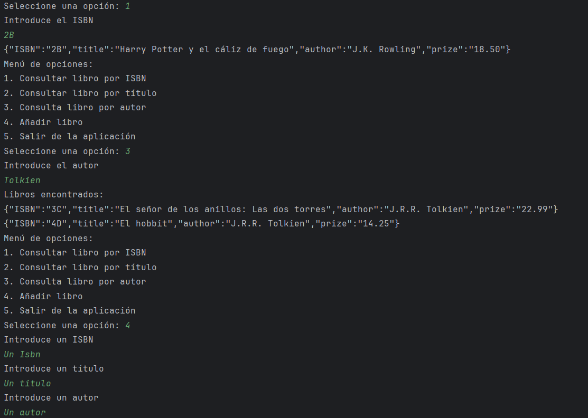
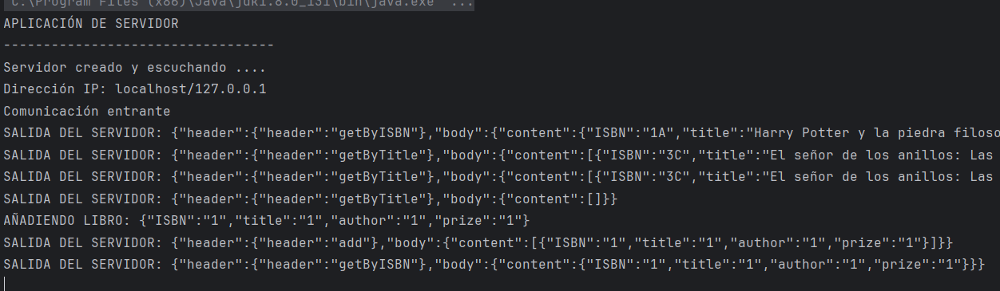

# Actividad 1. Hilos y Sockets

### Arquitectura del programa

Como paso previo comenzamos diseñando la arquitectura del programa a desarrollar.
De acuerdo a los requirementos del ejercicio, y simplemente leyendo el enunciado, sabemos que necesitaremos los siguientes componentes:
1. Un servidor, donde se ejecutarán todas las operaciones "sensibles" y la lógica interna de la aplicación.
2. Un cliente, donde se ejecutarán las operaciones de interacción con el servidor.
3. Un modelo "Libro", correspondiente a la clase principal de nuestro programa.
4. Un modelo DAO, que encapsulará la lógica de todas las operaciones relacionadas con el Libro.

Los dos programas quedarían estructurados así:

CLIENTE
    |_ Clase main

SERVIDOR
    |_ Clase main
    |_ DAO
    |   |_ LibroDao
    |_ Models
        |_ Libro

Opcionalmente, sería posible crear un "buffer libros", pero dado que el concepto del progrmaa es una "Biblioteca", se da por hecho que habrá cierta persistencia en la recopilación y almacenamiento de datos, por lo que es más apropiado trabajar con un DAO.

## Desarrollo del cliente

El cliente debe incluir dos funcionalidades:
1. Una funcionalidad para recopilar todos los datos y enviar peticiones al servidor. 
2. Una segunda funcionalidad para recibir las respuestas del servidor e interpretarlas correctamente.

### Envío de peticiones

En nuestro caso, nos enfrentamos a la problemática de que el usuario requiere enviar dos tipos de datos: por un lado un tipo de operación (method), por otro lado un cuerpo con cierta información (body). Si estuviésemos en un contexto de html y servidor web esto podríamos resolverlo a través de un sistema de URLs capaz de redirigir las peticiones de GET, PUT y POST con su respectivo body. Esta parte la podriamos resolver con el envío de un XML o un JSON con su respectivo header y cuerpo. 

En nuestro caso, hemos optado por enviar un objeto de tipo JSON con un "header" y un "body".  Para ello bastará con crear un JSON object e añadir ambas propiedades, tal que así:

````java

    JsonObject jsonRequest = new JsonObject();
    jsonRequest.addProperty("header", "getByISBN");
    jsonRequest.addProperty("body", bodyInput);
                        
````

Posteriormente, a la hora de enviar la petición, bastará con convertir el JSON  a texto plano antes de su envío.

````java
    salida.write((jsonRequest.toString() + "\n").getBytes());
````

### Recepción de respuestas

A la hora de recibir la respuesta en el cliente, también se ha optado por utilizar un formato JSON, que en este caso bien podrá recibirse dentro del "body" un JSON Object -para cuando se reciba un solo libro-, un JSON Array -para cuando en la consulta se requieran varios libros.

Para recibir la respuesta, bastará con parsear el JSON y obtener el contenido del "body" de la respuesta:

````java
    InputStream entrada = cliente.getInputStream();
    BufferedReader reader = new BufferedReader(new InputStreamReader(entrada));
    //Resto del código para recibir la respuesta
    //...

    String mensaje = reader.readLine();
    JsonObject jsonResponse = JsonParser.parseString(mensaje).getAsJsonObject();
    JsonObject headerResponse = jsonResponse.getAsJsonObject("header");
    JsonObject bodyResponse = jsonResponse.getAsJsonObject("body");

    
````

Posteriormente, debemos saber hacer una correcta lectura tanto del header como del body. Nosotros sabemos que el header únicamente contiene un String (aunque en un caso real podría contener todo tipo de información). Sin embargo, el body puede ser tanto un Array como un Object o un Boolean, lo que nos obliga a tratar el body como un JSON Element y no especificar de qué tipo se trata.

````java
    String messageHeader = headerResponse.get("header").getAsString();
    JsonElement contentResponse = bodyResponse.get("content");

````

El siguiente paso será tratar el contenido del body. En este caso, se ha optado por un switch-case para tratar los diferentes tipos de respuesta que se pueden recibir:

````java
    switch (messageHeader) {
        case "getByISBN":
            JsonObject selectedBook = contentResponse.getAsJsonObject();
            break;
        case "getByTitle": case "getByAuthor":
            JsonArray selectedBooks = contentResponse.getAsJsonArray();
            break;
        case "postBook":
            boolean value = contentResponse.getAsBoolean();
            break;
    }
````

Hecho este paso, ya disponemos dentro del cliente tanto el objeto Libro como el Array, lo cuál nos permitirá acceder libremente tanto a las propiedades de cada objeto recuperado, como iterar sobre cada objeto del array. Como paso final, verificamos que el array no está vacío (! array.isEmpty) o que su tamaño es mayor que 0 (object.size() != 0). Si se cumple alguna de estas condiciones, debemos informar al cliente que no se ha recuperado ningún objeto del servidor. 

Para el caso de postBook, se ha optado por notificar con un boolean si la operación ha sido exitosa o no.


## Desarrollo del servidor

La arquitectura del servidor es sutilmente más compleja. Una vez se ha establecido exitosamente la conexión, debemos recibir la información que llega del cliente. Esta información llega como texto plano por lo que será necesario parsearla.


### Estableciendo la conexión

```java
lic class Servidor {

    public static void main(String[] args) {
        LibroDAO biblioteca = new LibroDAO();
        
        String ipv4 = "localhost";
        System.out.println("APLICACIÓN DE SERVIDOR");
        System.out.println("----------------------------------");

        try {
            ServerSocket servidor = new ServerSocket();
            InetSocketAddress direccion = new InetSocketAddress(ipv4, 2000);
            servidor.bind(direccion);
            System.out.println("Servidor creado y escuchando .... ");
            System.out.println("Dirección IP: " + direccion.getAddress());

            while (true) {
                Socket enchufeAlCliente = servidor.accept();
                System.out.println("Comunicación entrante");

                // Creamos un nuevo hilo para manejar al cliente
                new Thread(() -> {
                    // Resto del código

```

Una vez está la conexión está establecida, debemos crear un hilo para cada cliente (new Thread()). El hilo espera como parámetro una función lambda que se ejecutará cada vez que un cliente se conecte al servidor. Dentro del hilo, definimos los pasos a seguir para recibir la petición del cliente y enviar la respuesta (el InputStream y el OutputStream, con sus respectivos reader y writer).

```java
     //ENTRADA
    InputStream entrada = enchufeAlCliente.getInputStream();
    BufferedReader reader = new BufferedReader(new InputStreamReader(entrada));
    String mensaje = reader.readLine();

    //SALIDA
    OutputStream salida = enchufeAlCliente.getOutputStream();
    PrintWriter writer = new PrintWriter(new OutputStreamWriter(salida), true);
    

```

### Recepción de la petición

Los canales ya están abierto y se pueden recibir mensajes. Ahora toca "descifrar" las peticiones entrantes. Nosotros hemos decidido trabajar con objetos de tipo JSON. Eso nos obliga a parsear el texto plano que llega del cliente y convertirlo en un objeto JSON. 


```java
    while (mensaje != null) {
        // Objeto para ENVIAR respuesta al CLIENTE
        JsonObject jsonResponse = new JsonObject();
        JsonObject header = new JsonObject();
        JsonObject body = new JsonObject();
        jsonResponse.add("header", header);
        jsonResponse.add("body", body);

        // Objeto para RECIBIR petición
        JsonObject jsonRequest = JsonParser.parseString(mensaje).getAsJsonObject();
        String requestHeader = jsonRequest.get("header").getAsString();
        String requestBody;
```
Puesto que ya tenemos el tipo de método que se quiere aplicar y un cuerpo, será suficiente con aplicar un switch-case y guardar el resultado dentro de nuestro jsonResponse (la respuesta del servidor). A su vez, la respuesta irá con header, que permitirá al cliente saber qué tiene que hacer con cada respuesta, y un body, con el contenido propiamente.

### Posibles respuestas

Como veaíamos en el cliente, existen diferentes posibles respuestas, que pueden ir en los siguientes formatos:

1. Un JsonObject (si solo se devuelve un libro).
2. Un JsonArray (si se devuelven varios libros).
3. Un boolean (si se ha añadido un libro, que puede resultar en true o false).
4. Un objeto o un array vacío (si no hay coincidencias en la base de datos).
5. Un mensaje de salida para cuando se cierra la conexión.


Sea cual sea el objeto de respuesta del servidor, lo convertiremos a texto plano y lo enviaremos:

````java
    salida.write((jsonResponse.toString() + "\n").getBytes() );
````

### Modelos DAO (synchronus) y Libro

En este punto no nos entretendremos demasiado. Es suficinete con saber que tanto el DAO como el Libro encapsulan la lógica de los objetos creados y las operaciones CRUD (aunque en este ejercicio solo se presentan operaciones de consulta y añadido).

Como detalle importante, la operación "añadir" debe quedar bloqueada en caso de que uno de los hilos acceda a ella, y solamente desbloqueará el programa cuando concluya. Para simular este "bloqueo" -y comprobar que efectivamente el programa ha quedado bloqueado- se ha decido implementar un Threat.sleep(3000) para simular que el bloqueo funciona correctamente, es decir, nunca van a llegar varias peticiones de añadir libro simultáneamente.

````java

    public synchronized boolean add(JsonObject bookObject) {
        String isbn = bookObject.get("ISBN").getAsString();
        String title = bookObject.get("title").getAsString();
        String author = bookObject.get("author").getAsString();
        String prize = bookObject.get("prize").getAsString();
        System.out.println("AÑADIENDO LIBRO: " + bookObject.toString());

        Libro nuevoLibro = new Libro(isbn, title, author, prize);
        try {
            /*Simulamos un retraso de 4 segundos.
            * Si el hilo está bien sincronizado, nunca podrán salir por consola
            * simultaneamente varios mensajes, ya que el hilo está bloqueando el proceso.*/
            Thread.sleep(4000);

            if (findByIsbn(nuevoLibro.getISBN()).size() != 0){
                System.out.println("El libro ya existe");
                return false;

            } else {
                listaLibros.add(nuevoLibro);
            }
            return true;

        } catch (InterruptedException e) {
            Thread.currentThread().interrupt(); // Restaura el estado de interrupción
        } catch (Exception e){
            System.out.println("Datos incompletos, introduce un formato de libro válido");
            return false;
        }
        return true;
    }
````

Dentro del DAO, el único método que tiene cierta complejidad es el de añadir libro, que, como comentábamos antes, recibe un objeto completo y necesitará acceder a cada propiedad de dicho objeto para crear un nuevo libro.

### Observaciones

- Dentro del código hay varios mensajes por consola para depurar y comprobar que el programa funciona correctamente. En un caso real, estos mensajes deberían ser eliminados o comentados.s

- La propiedad "prize" del libro se ha declarado como String, aunque en un caso real debería ser un tipo numérico (double o float). Al no haber operaciones aritméticas, y para evitar tener que realizar un casting, se ha simplificado como String.

- En un caso real, y dentro del cliente, verificaríamos que el JSON que está llegando se corresponde exactamente con el tipo que queremos manejar. Es decir, nosotros damos por hecho que al recibir un JSON Object de verdad se trata de un Json Object, y por ello manipulamos el objeto directamente, aunque esto es algo que debemos verificar antes de ejecutar. 


## Resultados

A continuación se presentan los patanllazos de la ejecución del programa:



